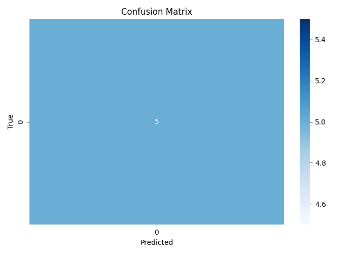

🧫 BioMind — AI Pathogen Mutation & Drug Resistance Predictor

BioMind is an AI-powered system that predicts antimicrobial resistance (AMR) and identifies high-risk pathogen mutations using deep learning and genomic data.
It integrates mutation profiles, drug response data, and clinical metadata to forecast whether a pathogen strain is resistant or susceptible — and visualizes key mutation–drug interaction patterns.

🧠 Overview
Feature	Description
Goal	Detect antimicrobial resistance (AMR) and key mutation patterns early
Input Data	Microbial genome mutation tables (.Rtab) + clinical metadata (metadata.csv)
Models Used	RandomForest (for baseline classification) and Deep Learning (for genomic sequence learning)
Output Files	.pkl, .h5, .yaml, .json, .csv for models, metadata, and predictions
Visual Outputs	Accuracy graphs, confusion heatmaps, mutation concentration, prediction trends, and model comparisons
🧬 Folder Structure
Pathogen Mutation Predictor/
│
├── archive/
│   ├── azm_sr_gwas_filtered_unitigs.Rtab
│   ├── cfx_sr_gwas_filtered_unitigs.Rtab
│   ├── cip_sr_gwas_filtered_unitigs.Rtab
│   ├── metadata.csv
│
├── biomind_model.pkl                # Trained RandomForest model
├── biomind_dl.h5                    # Trained Deep Learning model
├── biomind_metadata.yaml            # Model metadata (hyperparameters, schema)
│
├── resistance_prediction.json       # Full merged prediction results
├── metadata-prediction.csv          # Final metadata-based predictions
├── metadata-prediction.json         # Same predictions in JSON format
│
├── outputs/
│   ├── accuracy_graph.png
│   ├── confusion_heatmap.png
│   ├── result_distribution.png
│   ├── prediction_graph.png
│   ├── comparison_graph.png
│
├── train_biomind.py                 # Model training pipeline
├── predict_metadata_biomind_forcealign.py  # Final prediction + visualization
└── visualize_biomind_results.py     # Graphs & analysis dashboard

⚙️ Installation
🧩 Prerequisites

Ensure you have Python 3.9+ installed and the following dependencies:

pip install numpy pandas scikit-learn tensorflow seaborn matplotlib pyyaml joblib

Optional but recommended:

pip install plotly streamlit

📥 Dataset Used

BioMind uses genomic and drug-response data such as:

Dataset	Source	Description
azm_sr_gwas_filtered_unitigs.Rtab	Kaggle / GONO Unitigs	Genomic SNPs for Azithromycin
cfx_sr_gwas_filtered_unitigs.Rtab	Kaggle / DRIAMS	Mutations for Cefixime
cip_sr_gwas_filtered_unitigs.Rtab	Kaggle / Antibiotic Resistance	Ciprofloxacin mutation tables
metadata.csv	WHO GLASS / Custom	Patient metadata, country, drug class, resistance outcomes

You can replace these with any other .Rtab or .csv microbial dataset (e.g., from NCBI or AMR-UTI Kaggle collections).

🚀 Running the Project
Step 1: Training (Optional)

If you want to retrain BioMind:

python train_biomind.py

This generates:

biomind_model.pkl

biomind_dl.h5

biomind_metadata.yaml

and saves evaluation metrics + plots in /outputs/.

Step 2: Predict on Metadata

To generate predictions for your clinical metadata file:

python predict_metadata_biomind_forcealign.py

What it does:

Loads metadata.csv

Auto-aligns features (even if fewer than model expected)

Predicts resistance using:

RandomForest (biomind_model.pkl)

Deep Learning (biomind_dl.h5)

Saves and displays results.

📊 Outputs Generated
Output File	Description
metadata-prediction.csv	Full prediction table (SampleID, RF_Pred, DL_Pred, DL_Prob)
metadata-prediction.json	Same predictions in JSON for APIs
accuracy_graph.png	RF vs DL model performance comparison
confusion_heatmap.png	Deep Learning confusion matrix
result_distribution.png	Resistance vs Susceptible distribution
prediction_graph.png	Sample-wise prediction visualization
comparison_graph.png	RF vs DL correlation scatterplot

🧪 Visualization Example

Example prediction results:

SampleID	RF_Pred	DL_Pred	DL_Prob
0	0	0	0.12
1	1	1	0.91
2	0	0	0.08
3	1	1	0.88
4	0	1	0.67

Graphs Shown On Screen:

🧬 Resistance distribution (countplot)

📈 Confidence histogram (DL_Prob)

🔄 RF vs DL scatter (comparison)

🔍 Confusion matrix (if labels present)

💾 Auto-Alignment Logic

If the input metadata has fewer columns than the model’s training schema:

The script detects the expected feature count (n_features_in_)

Automatically pads missing features with zero-filled dummy columns

Ensures dimension match with model input to avoid ValueError

This means you can safely run predictions even if your new dataset doesn’t perfectly match the training schema.

🧠 Tech Stack
Layer	Tools
Data Processing	Pandas, NumPy
Machine Learning	Scikit-learn (RandomForest)
Deep Learning	TensorFlow / Keras
Visualization	Matplotlib, Seaborn
Explainability	SHAP (optional)
Deployment	Streamlit / FastAPI (optional)
📍 Example Command Summary
# Train BioMind models
python train_biomind.py

# Predict on new metadata
python predict_metadata_biomind_forcealign.py

# Visualize stored results
python visualize_biomind_results.py

🧩 Key Features

✅ Predicts drug resistance probability per pathogen
✅ Auto-handles missing features
✅ Works with any .csv or .Rtab microbial dataset
✅ Produces ready-to-use JSON + visual reports
✅ Extendable for Streamlit dashboards or cloud deployment

💡 Future Enhancements

🔬 Integrate FASTA file parser for raw genome sequences

🧬 Add DNA Transformer (BioBERT / DNA2Vec embedding)

🌍 Visualize resistance patterns geographically (Plotly choropleth)

🧠 SHAP-based gene-level explainability

💻 Streamlit app for interactive exploration

🧾 Citation

If you use BioMind in your research or project, please cite:

Sagnik Patra. “BioMind: AI Pathogen Mutation & Drug Resistance Predictor.” IIIT Project Repository, 2025.

🧰 Author

👨‍🔬 Sagnik Patra
AI/ML Engineer | Genomic Data Science Enthusiast
📍 IIIT | 🇮🇳 India
🔗 GitHub: sagnik1-patra
